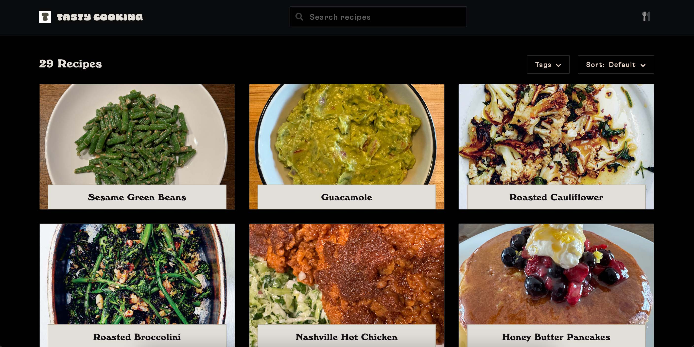
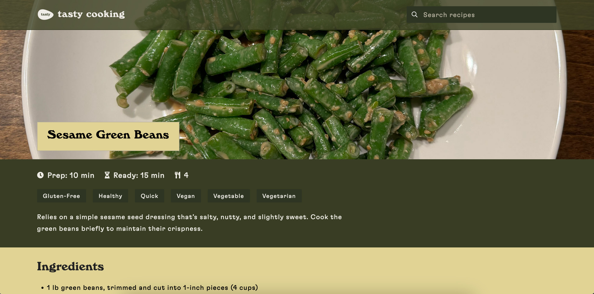
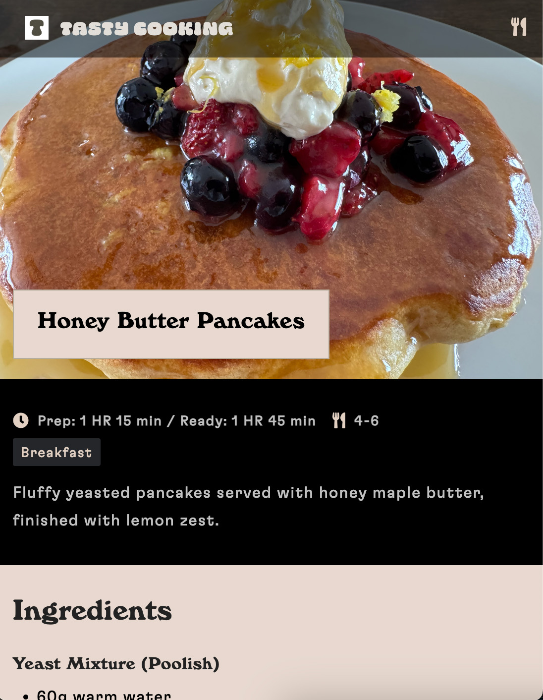

# Tasty Cooking

A beautiful, fast, and accessible recipe collection website with a clean, modern design. Tasty Cooking provides an elegant platform for discovering and sharing delicious recipes with a focus on performance, accessibility, and visual appeal with no clutter.

[](https://github.com/douvy/tasty-cooking)

## [Live Demo](https://www.tasty.cooking/)



## Features

- **Lightning Fast**: Optimized with compression, modern caching strategies, and minimal JS
- **Fully Responsive**: Beautiful on all devices from mobile to desktop
- **Accessible**: WCAG compliant with proper semantic HTML and keyboard navigation
- **SEO Optimized**: Rich metadata, JSON-LD Schema.org markup, and optimized for search engines
- **Progressive Web App**: Works offline and can be installed on mobile devices
- **Beautiful Typography**: Custom fonts with attention to readability and aesthetics
- **High-Quality Images**: Optimized for fast loading with WebP format support
- **Clean Architecture**: Well-organized code structure for easy maintenance

## Screenshots

<div align="center">
  
  
</div>

## Design Philosophy

Tasty Cooking was built with these principles in mind:

- **Minimalist Design**: Clean white title bars create visual breathing room and help content stand out. The high contrast ensures readability while maintaining elegance.

- **Typography**: We use a carefully selected font combination:
  - **Windsor Bold** for headings: A classic serif with personality that adds warmth and character
  - **GT Flexa** for body text: A modern sans-serif that ensures excellent readability at all sizes

- **Color Palette**: Our colors are inspired by natural cooking ingredients:
  - Dark charcoal background: Creates drama and makes food photos pop
  - Warm beige accents: Adds warmth reminiscent of baked goods
  - Strategic use of white space: Creates visual breathing room

- **Performance First**: Every design decision was weighed against performance impact, ensuring a fast experience even on slower connections.

## Getting Started

### Prerequisites

- Node.js (v14.x or later)
- npm or yarn

### Installation

1. Clone the repository
```bash
git clone https://github.com/username/tasty-cooking.git
cd tasty-cooking
```

2. Install dependencies
```bash
npm install
```

3. Start the development server
```bash
npm start
```

4. Open your browser and visit http://localhost:3000

## Built With

- [Express](https://expressjs.com/) - Fast, unopinionated web framework for Node.js
- [TailwindCSS](https://tailwindcss.com/) - Utility-first CSS framework
- Pure JavaScript - No heavy frameworks

## Project Structure

```
tasty-cooking/
├── assets/            # Static assets (images, fonts)
│   ├── fonts/         # Custom web fonts
│   └── img/           # Recipe and UI images
├── css/               # Stylesheets
├── js/                # JavaScript files
├── *.html             # Recipe pages
├── server.js          # Express server for serving content
└── package.json       # Project dependencies and scripts
```

## Performance Optimizations

- **Compression**: All responses are compressed with gzip/brotli
- **Caching Strategy**: Intelligent cache headers based on content type
- **Font Loading**: Preloaded critical fonts with font-display:swap
- **Image Optimization**: WebP format with appropriate sizing
- **CSS Minification**: Reduced CSS file size
- **JavaScript**: Minimal, non-blocking scripts

## SEO Features

- Schema.org structured data for recipes
- Open Graph and Twitter card meta tags
- Semantic HTML structure
- Optimized meta descriptions and titles
- XML sitemap and robots.txt

## Contributing

Contributions are welcome! Please feel free to submit a Pull Request.

1. Fork the repository
2. Create your feature branch (`git checkout -b feature/amazing-feature`)
3. Commit your changes (`git commit -m 'Add some amazing feature'`)
4. Push to the branch (`git push origin feature/amazing-feature`)
5. Open a Pull Request

## License

This project is licensed under the MIT License - see the [LICENSE](LICENSE) file for details.

## Acknowledgments

- Icons from [Font Awesome](https://fontawesome.com)

---

If you found this project helpful, please consider giving it a star!

[Back to top](#tasty-cooking)